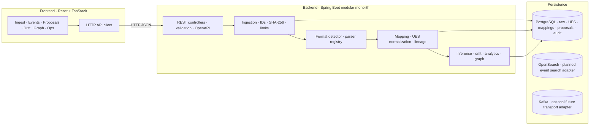

# PolyFlux architecture

PolyFlux follows the attached ULPF architecture baseline. The PDF’s `[P0]`, `[P1]`, `[P2]`, `[KF]` and `[FUTURE]` markers are project scope labels; document content is used as technical reference.

## Project layout

- `backend/`: Java 21 / Spring Boot 3.5 modular monolith. Package boundaries separate API, ingestion, parser, normalization, schema, inference, drift, analytics and storage. Flyway owns schema changes; PostgreSQL persists raw records, normalized UES documents, immutable mapping versions, source bindings, proposals, drift, alerts, DLQ and audit.
- `frontend/`: standalone React/TanStack application. `src/lib/ulpf/api.ts` is its backend boundary; `vite.config.ts` proxies `/api` to Spring Boot in local development.
- `docker-compose.yml`: local PostgreSQL, Spring backend and separately built frontend.

## API

| Method | Path | Purpose |
|---|---|---|
| GET | `/api/v1/state` | Dashboard snapshot |
| POST | `/api/v1/events` | Text, NDJSON, JSON-array or JSON-wrapped event ingestion |
| POST | `/api/v1/ingest/file` | Multipart file ingestion |
| POST | `/api/v1/proposals/{id}/approve` | Approve suggested mapping and replay matching raw records |
| POST | `/api/v1/proposals/{id}/reject` | Reject a pending proposal |
| POST | `/api/v1/reprocess` | Replay preserved raw records |
| POST | `/api/v1/dlq/retry` | Retry DLQ records |
| POST | `/api/v1/reset` | Clear demo data and seed built-in mappings |
| POST | `/api/public/v1/events` | Public pipeline ingestion |
| GET | `/api/public/v1/health` | ULPF service health |
| GET | `/swagger-ui/index.html` | OpenAPI UI |

## Implementation status

| Capability | Status |
|---|---|
| Separate frontend and Spring Boot backend | Implemented |
| PostgreSQL persistence and Flyway schema | Implemented |
| Cisco ASA, Fortinet KV, CEF, LEEF, JSON, CSV, generic KV and syslog parsing | Implemented in Java parser registry |
| UES v1 mapping, coercion, extensions, lineage and deterministic event IDs | Implemented |
| KF1 inferred proposal, analyst approval and replay | Implemented |
| KF3 schema drift proposals | Implemented |
| Rule analytics and event graph dashboard | Partially implemented; port-scan/brute-force alerts are in Java, other prototype rules/graph details need parity work |
| OpenSearch storage/search, Kafka, Redis, syslog UDP/TCP, auth/RBAC, rate limiting | Not implemented |
| ML anomaly detection and ECS/OCSF adapters | Roadmap |

Run `docker compose up --build` for the complete local stack. For local development run PostgreSQL with Compose and start Spring (`cd backend; mvn spring-boot:run`) and the frontend (`cd frontend; bun run dev`) separately. See README for demo steps.
